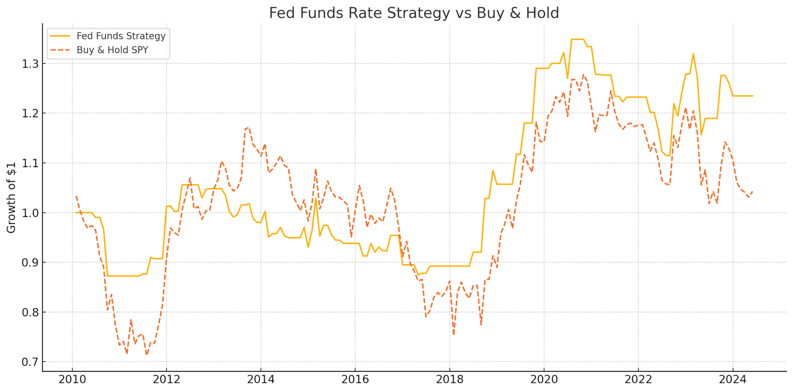

# fed-funds-rate-SPY
A simple rules-based model combining FRED data with SPY price action.

# SPY Trading Strategy Using the Fed Funds Rate

This project explores a simple rule-based strategy for trading SPY based on changes in the Federal Funds Rate. The idea is to react to shifts in monetary policy—buying into the market when interest rates are falling, and staying out when they're not.

## How It Works

Every month, we check if the Fed cut rates compared to the previous month. If so, we go long SPY. If not, we sit in cash. The logic is that falling rates generally support equity markets, so this approach tries to ride that momentum.

The strategy:
- Runs on monthly data (no overtrading).
- Uses publicly available data from Yahoo Finance and the Federal Reserve (FRED).
- Compares performance to a basic buy-and-hold of SPY.

## Data

- **SPY price history** from Yahoo Finance
- **Effective Federal Funds Rate** from FRED

We use Python libraries like `yfinance`, `pandas_datareader`, and `matplotlib` to pull, process, and visualize the data.

## Results (2013–2024 sample)

| Metric         | Strategy    | Buy & Hold |
|----------------|-------------|------------|
| Total Return   | +23.5%      | +188.7%    |
| Sharpe Ratio   | 0.20        | 0.78       |
| Max Drawdown   | -17.3%      | -33.7%     |

This approach underperforms buy-and-hold, but shows lower drawdowns and serves as a decent example of macro signal filtering.

### Strategy vs. Buy & Hold

The chart shows how the Fed Funds strategy (solid line) compares to a buy-and-hold of SPY (dashed). The strategy avoids large drawdowns by sitting out of the market during rate hike periods.

## Files Included

- `fed_funds_strategy.py` — full codebase for the strategy
- `fed_funds_strategy_data.csv` — saved strategy outputs
- `fed_funds_strategy_chart.png` — visualization of performance

## Performance Chart

## Notes

This is a simple proof-of-concept meant to show basic finance skills—using macro data, building trading logic, and analyzing performance. It’s not meant for real trading.

